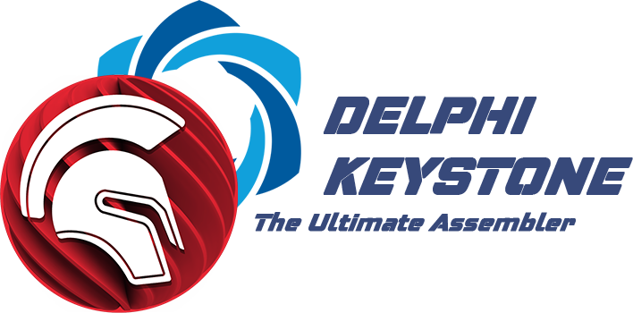

### Delphi Keystone - The Ultimate Assembler

Keystone is a lightweight multi-platform, multi-architecture assembler framework.
Multi-architecture, with support for Arm, Arm64 (AArch64/Armv8), Ethereum Virtual Machine, Hexagon, Mips, PowerPC, Sparc, SystemZ, & X86 (include 16/32/64bit).
Keystone is based on LLVM, but it goes much further with a lot more to offer. 

https://www.keystone-engine.org/

#